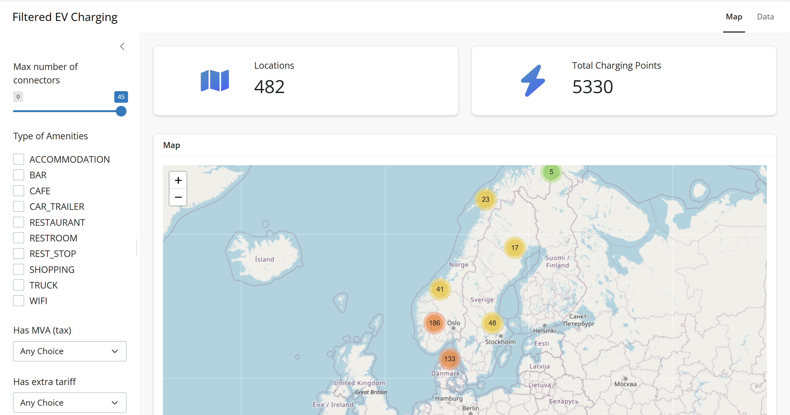
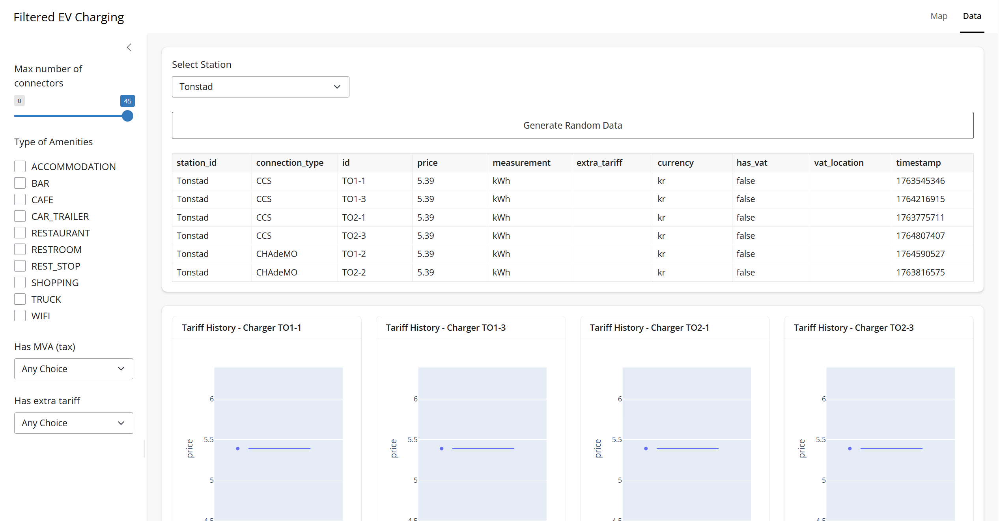
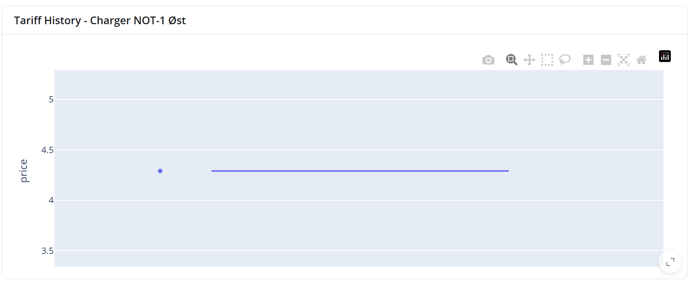
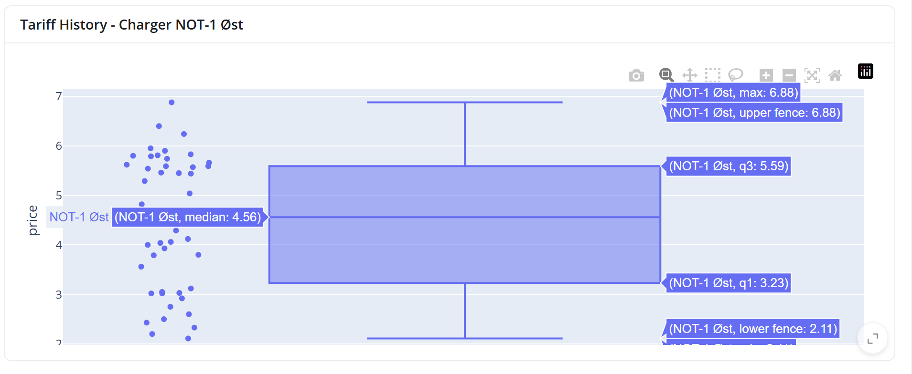

# EV Shiny App

EV Charging Dashboard built with **Shiny for Python**

## Deployment

### Option A — Devcontainer (Recommended)

This project includes a devcontainer that provides a fully isolated development environment with all required tools preinstalled. Devpod automatically configures the workspace so you can start coding immediately without installing dependencies on your local machine.

#### How to use it

1. Make sure you have **Docker** or **Podman** enabled.
2. Install **[Devpod](https://devpod.sh)**.
3. Configure a provider as described **[here](https://devpod.sh/docs/managing-providers/add-provider)**.
4. Select the repository, choose your preferred IDE, and provide a workspace name.

The configuration will automatically create a development-ready environment with everything required to run the app.

---

### Option B — Manual Setup

1. Install **Python 3.14**.
2. Install the dependencies:

```bash
pip install -r requirements.txt
```

---

## Run the Project

### Run the Shiny app (from the project root):

```bash
shiny run --launch-browser app.py
```

Access it at: [http://localhost:8000](http://localhost:8000)

### Run the Jupyter notebook:

```bash
jupyter lab --ip=0.0.0.0 --port=8888 --no-browser
```

Access it at: [http://localhost:8888](http://localhost:8888)
(The token appears in the terminal logs.)

---

# Description of the Analysis

This project is divided into two parts:

1. **Data analysis** using Jupyter Notebooks
2. **Interactive visualization** using Shiny

Using publicly available data from
`https://charging.eviny.no/api/map/chargingStations`,
the goal is to create visualizations that help users understand the geographical distribution of EV charging stations and compare pricing between terminals.

The process begins by extracting and normalizing the terminals within each station, producing two tables:

* **Station-level data** (`location`, `name`, `address`, etc.)
* **Terminal-level data** (connector–specific pricing and metadata)

While exploring the data, it became clear that a station's terminals may have different pricing rules depending on the connector type. After analyzing the raw table, the following fields were extracted:

1. **Price**
2. **Currency** (e.g., `kr`)
3. **Measurement** (e.g., `kWh`)
4. **Extra tariff** (e.g., `Over 80%: + kr 1/minutt`)
5. **VAT flag** (e.g., `4,0 kr/kWh + MVA`, defaults to `False`)
6. **VAT location** (e.g., `hurtiglading Lofoten`)

The provided dataset does not include timestamps; therefore, a synthetic timestamp column was generated using random values within a defined time window to simulate historical data.

Further data cleaning was applied, including:

* Dropping rows with invalid or missing price values
* Using regex to extract numerical fields
* Splitting multi-value text fields into structured columns

By separating station and terminal tables, we make it easy to continuously append new historical entries—each new row simply references the station ID and terminal ID.

Values such as *total number of connectors* were removed from the station table, since they can be recomputed dynamically from the historical utilization table by counting unique terminal ID for each station ID.

# Shiny Visualization

Shiny is used to provide a dynamic, reactive interface.
Once the cleaned CSV files are generated in the `assets` folder, they are loaded into DataFrames, allowing real-time filtering and interactive visualizations.



* **Left side:** global filters (connectors, amenities, extra tariffs, etc.)
* **Right side:** the main visualization and detail panels

## Filters

All filters are reactive.
For example, selecting amenities and then adjusting the maximum number of connectors will update the dataset to show only stations matching *both* filters.


## Map Section

The map is generated using the cleaned dataset in
`assets/charging_stations.csv`.

You may notice that the number of displayed stations is slightly lower than the initial raw data. This is due to the cleaning process, only **car** stations with at least **one priced terminal** were retained.

```
Started with: 487 stations
Kept:         482 stations
```

The *Locations* and *Total Charging Points* banners reflect both the cleaned data and any user-applied filters.

## Data Section

> **⚠️ WARNING:** This section is compute-heavy. Allow it to fully render before applying additional filters.



This section allows users to explore individual stations based on filter selections. Data can be viewed as:

* Raw tables
* Per-terminal boxplots

Because the initial dataset does not contain a full history of prices, the `Generate Random Data` button create an additional 50 historical entries for richer visualizations.

### Before Generating Random Data



### After Generating Random Data



> **⚠️ If the view does not update:** Select a different station, then return to the previous one to trigger a refresh.

## Why Box Plots?

I chose a box plot instead of a line graph as a visualization mechanism because it can represent better visualization of data abstraction as this data doesn’t have a specific trend (not evenly spaced or time-continuous). 

In the first iterations of the application, data was visualized using line graphs but it started to get messy, specifically for stations that have a lot of chargers. So just being able to separate chargers into different box plots enables a better comparison between different terminals.
